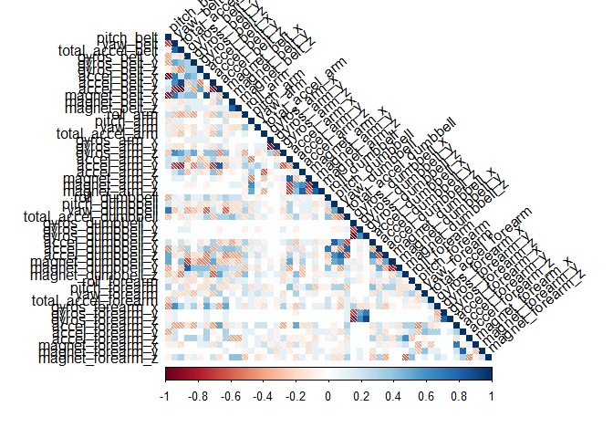
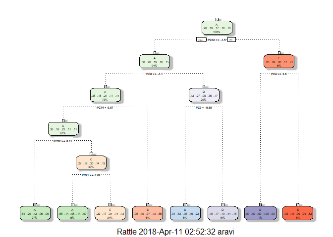
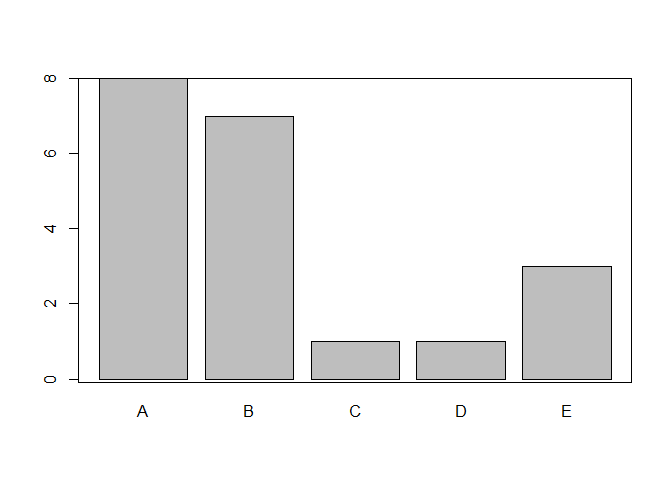
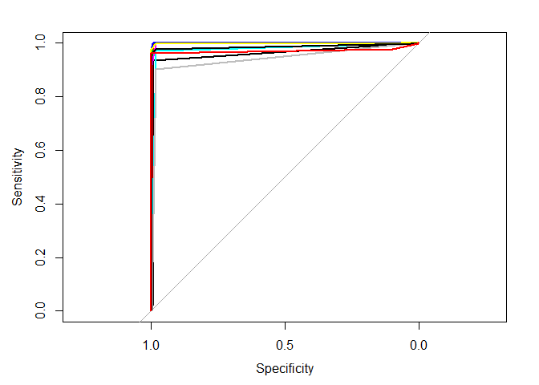
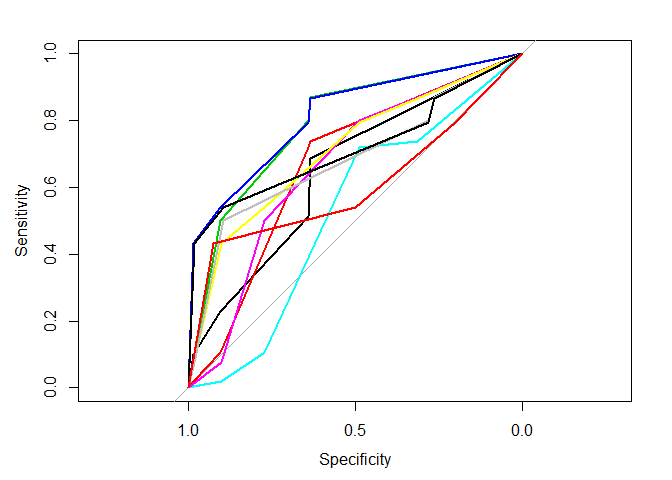
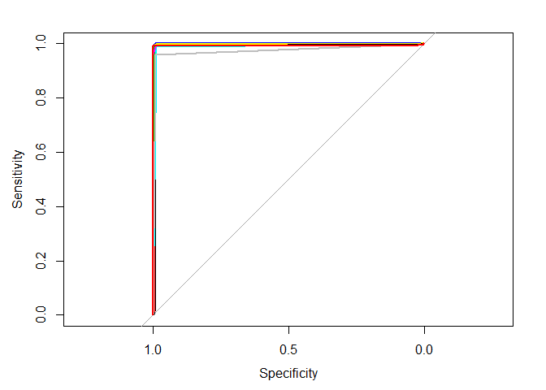
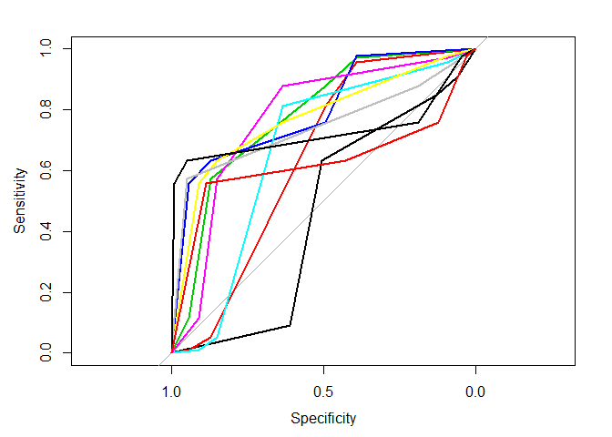

Data Analysis on Weight Lifting Exercise Dataset
================================================

Background
----------

Using devices such as Jawbone Up, Nike FuelBand, and Fitbit it is now
possible to collect a large amount of data about personal activity
relatively inexpensively. These type of devices are part of the
quantified self movement - a group of enthusiasts who take measurements
about themselves regularly to improve their health, to find patterns in
their behavior, or because they are tech geeks. One thing that people
regularly do is quantify how much of a particular activity they do, but
they rarely quantify how well they do it. In this project, your goal
will be to use data from accelerometers on the belt, forearm, arm, and
dumbell of 6 participants. They were asked to perform barbell lifts
correctly and incorrectly in 5 different ways. More information is
available from the website here:
<http://web.archive.org/web/20161224072740/http:/groupware.les.inf.puc-rio.br/har>
(see the section on the Weight Lifting Exercise Dataset).

Data
----

The training data for this project are available here:

[training](https://d396qusza40orc.cloudfront.net/predmachlearn/pml-training.csv)

The test data are available here:

[testing](https://d396qusza40orc.cloudfront.net/predmachlearn/pml-testing.csv)

The data for this project come from this source: [Weight Lifting
Exercise
Dataset](http://web.archive.org/web/20161224072740/http:/groupware.les.inf.puc-rio.br/har)

Objective
---------

The goal of the project is to predict the manner in which they did the
exercise. The outcome variable is the "classe" variable in the training
dataset. A detailed report on how to built the model, cross validation,
expected out of sample error, and choices made to clean the dataset is
presented. The machine learning algorithms are implemented and then
compared based on the test dataset.

Analysis
--------

### Required packages

    library(corrplot)

    ## corrplot 0.84 loaded

    library(caret)

    ## Loading required package: lattice

    ## Loading required package: ggplot2

    library(dplyr)

    ## 
    ## Attaching package: 'dplyr'

    ## The following objects are masked from 'package:stats':
    ## 
    ##     filter, lag

    ## The following objects are masked from 'package:base':
    ## 
    ##     intersect, setdiff, setequal, union

    library(rattle)

    ## Rattle: A free graphical interface for data science with R.
    ## Version 5.1.0 Copyright (c) 2006-2017 Togaware Pty Ltd.
    ## Type 'rattle()' to shake, rattle, and roll your data.

    library(randomForest)

    ## randomForest 4.6-14

    ## Type rfNews() to see new features/changes/bug fixes.

    ## 
    ## Attaching package: 'randomForest'

    ## The following object is masked from 'package:rattle':
    ## 
    ##     importance

    ## The following object is masked from 'package:dplyr':
    ## 
    ##     combine

    ## The following object is masked from 'package:ggplot2':
    ## 
    ##     margin

    library(klaR)

    ## Loading required package: MASS

    ## 
    ## Attaching package: 'MASS'

    ## The following object is masked from 'package:dplyr':
    ## 
    ##     select

    library(e1071)
    library(rpart)
    library(pROC)

    ## Type 'citation("pROC")' for a citation.

    ## 
    ## Attaching package: 'pROC'

    ## The following objects are masked from 'package:stats':
    ## 
    ##     cov, smooth, var

Loading the data
----------------

    training <- read.csv("https://d396qusza40orc.cloudfront.net/predmachlearn/pml-training.csv")
    testing <- read.csv("https://d396qusza40orc.cloudfront.net/predmachlearn/pml-testing.csv")
    dim(training)

    ## [1] 19622   160

    dim(testing)

    ## [1]  20 160

    str(training)

    ## 'data.frame':    19622 obs. of  160 variables:
    ##  $ X                       : int  1 2 3 4 5 6 7 8 9 10 ...
    ##  $ user_name               : Factor w/ 6 levels "adelmo","carlitos",..: 2 2 2 2 2 2 2 2 2 2 ...
    ##  $ raw_timestamp_part_1    : int  1323084231 1323084231 1323084231 1323084232 1323084232 1323084232 1323084232 1323084232 1323084232 1323084232 ...
    ##  $ raw_timestamp_part_2    : int  788290 808298 820366 120339 196328 304277 368296 440390 484323 484434 ...
    ##  $ cvtd_timestamp          : Factor w/ 20 levels "02/12/2011 13:32",..: 9 9 9 9 9 9 9 9 9 9 ...
    ##  $ new_window              : Factor w/ 2 levels "no","yes": 1 1 1 1 1 1 1 1 1 1 ...
    ##  $ num_window              : int  11 11 11 12 12 12 12 12 12 12 ...
    ##  $ roll_belt               : num  1.41 1.41 1.42 1.48 1.48 1.45 1.42 1.42 1.43 1.45 ...
    ##  $ pitch_belt              : num  8.07 8.07 8.07 8.05 8.07 8.06 8.09 8.13 8.16 8.17 ...
    ##  $ yaw_belt                : num  -94.4 -94.4 -94.4 -94.4 -94.4 -94.4 -94.4 -94.4 -94.4 -94.4 ...
    ##  $ total_accel_belt        : int  3 3 3 3 3 3 3 3 3 3 ...
    ##  $ kurtosis_roll_belt      : Factor w/ 397 levels "","-0.016850",..: 1 1 1 1 1 1 1 1 1 1 ...
    ##  $ kurtosis_picth_belt     : Factor w/ 317 levels "","-0.021887",..: 1 1 1 1 1 1 1 1 1 1 ...
    ##  $ kurtosis_yaw_belt       : Factor w/ 2 levels "","#DIV/0!": 1 1 1 1 1 1 1 1 1 1 ...
    ##  $ skewness_roll_belt      : Factor w/ 395 levels "","-0.003095",..: 1 1 1 1 1 1 1 1 1 1 ...
    ##  $ skewness_roll_belt.1    : Factor w/ 338 levels "","-0.005928",..: 1 1 1 1 1 1 1 1 1 1 ...
    ##  $ skewness_yaw_belt       : Factor w/ 2 levels "","#DIV/0!": 1 1 1 1 1 1 1 1 1 1 ...
    ##  $ max_roll_belt           : num  NA NA NA NA NA NA NA NA NA NA ...
    ##  $ max_picth_belt          : int  NA NA NA NA NA NA NA NA NA NA ...
    ##  $ max_yaw_belt            : Factor w/ 68 levels "","-0.1","-0.2",..: 1 1 1 1 1 1 1 1 1 1 ...
    ##  $ min_roll_belt           : num  NA NA NA NA NA NA NA NA NA NA ...
    ##  $ min_pitch_belt          : int  NA NA NA NA NA NA NA NA NA NA ...
    ##  $ min_yaw_belt            : Factor w/ 68 levels "","-0.1","-0.2",..: 1 1 1 1 1 1 1 1 1 1 ...
    ##  $ amplitude_roll_belt     : num  NA NA NA NA NA NA NA NA NA NA ...
    ##  $ amplitude_pitch_belt    : int  NA NA NA NA NA NA NA NA NA NA ...
    ##  $ amplitude_yaw_belt      : Factor w/ 4 levels "","#DIV/0!","0.00",..: 1 1 1 1 1 1 1 1 1 1 ...
    ##  $ var_total_accel_belt    : num  NA NA NA NA NA NA NA NA NA NA ...
    ##  $ avg_roll_belt           : num  NA NA NA NA NA NA NA NA NA NA ...
    ##  $ stddev_roll_belt        : num  NA NA NA NA NA NA NA NA NA NA ...
    ##  $ var_roll_belt           : num  NA NA NA NA NA NA NA NA NA NA ...
    ##  $ avg_pitch_belt          : num  NA NA NA NA NA NA NA NA NA NA ...
    ##  $ stddev_pitch_belt       : num  NA NA NA NA NA NA NA NA NA NA ...
    ##  $ var_pitch_belt          : num  NA NA NA NA NA NA NA NA NA NA ...
    ##  $ avg_yaw_belt            : num  NA NA NA NA NA NA NA NA NA NA ...
    ##  $ stddev_yaw_belt         : num  NA NA NA NA NA NA NA NA NA NA ...
    ##  $ var_yaw_belt            : num  NA NA NA NA NA NA NA NA NA NA ...
    ##  $ gyros_belt_x            : num  0 0.02 0 0.02 0.02 0.02 0.02 0.02 0.02 0.03 ...
    ##  $ gyros_belt_y            : num  0 0 0 0 0.02 0 0 0 0 0 ...
    ##  $ gyros_belt_z            : num  -0.02 -0.02 -0.02 -0.03 -0.02 -0.02 -0.02 -0.02 -0.02 0 ...
    ##  $ accel_belt_x            : int  -21 -22 -20 -22 -21 -21 -22 -22 -20 -21 ...
    ##  $ accel_belt_y            : int  4 4 5 3 2 4 3 4 2 4 ...
    ##  $ accel_belt_z            : int  22 22 23 21 24 21 21 21 24 22 ...
    ##  $ magnet_belt_x           : int  -3 -7 -2 -6 -6 0 -4 -2 1 -3 ...
    ##  $ magnet_belt_y           : int  599 608 600 604 600 603 599 603 602 609 ...
    ##  $ magnet_belt_z           : int  -313 -311 -305 -310 -302 -312 -311 -313 -312 -308 ...
    ##  $ roll_arm                : num  -128 -128 -128 -128 -128 -128 -128 -128 -128 -128 ...
    ##  $ pitch_arm               : num  22.5 22.5 22.5 22.1 22.1 22 21.9 21.8 21.7 21.6 ...
    ##  $ yaw_arm                 : num  -161 -161 -161 -161 -161 -161 -161 -161 -161 -161 ...
    ##  $ total_accel_arm         : int  34 34 34 34 34 34 34 34 34 34 ...
    ##  $ var_accel_arm           : num  NA NA NA NA NA NA NA NA NA NA ...
    ##  $ avg_roll_arm            : num  NA NA NA NA NA NA NA NA NA NA ...
    ##  $ stddev_roll_arm         : num  NA NA NA NA NA NA NA NA NA NA ...
    ##  $ var_roll_arm            : num  NA NA NA NA NA NA NA NA NA NA ...
    ##  $ avg_pitch_arm           : num  NA NA NA NA NA NA NA NA NA NA ...
    ##  $ stddev_pitch_arm        : num  NA NA NA NA NA NA NA NA NA NA ...
    ##  $ var_pitch_arm           : num  NA NA NA NA NA NA NA NA NA NA ...
    ##  $ avg_yaw_arm             : num  NA NA NA NA NA NA NA NA NA NA ...
    ##  $ stddev_yaw_arm          : num  NA NA NA NA NA NA NA NA NA NA ...
    ##  $ var_yaw_arm             : num  NA NA NA NA NA NA NA NA NA NA ...
    ##  $ gyros_arm_x             : num  0 0.02 0.02 0.02 0 0.02 0 0.02 0.02 0.02 ...
    ##  $ gyros_arm_y             : num  0 -0.02 -0.02 -0.03 -0.03 -0.03 -0.03 -0.02 -0.03 -0.03 ...
    ##  $ gyros_arm_z             : num  -0.02 -0.02 -0.02 0.02 0 0 0 0 -0.02 -0.02 ...
    ##  $ accel_arm_x             : int  -288 -290 -289 -289 -289 -289 -289 -289 -288 -288 ...
    ##  $ accel_arm_y             : int  109 110 110 111 111 111 111 111 109 110 ...
    ##  $ accel_arm_z             : int  -123 -125 -126 -123 -123 -122 -125 -124 -122 -124 ...
    ##  $ magnet_arm_x            : int  -368 -369 -368 -372 -374 -369 -373 -372 -369 -376 ...
    ##  $ magnet_arm_y            : int  337 337 344 344 337 342 336 338 341 334 ...
    ##  $ magnet_arm_z            : int  516 513 513 512 506 513 509 510 518 516 ...
    ##  $ kurtosis_roll_arm       : Factor w/ 330 levels "","-0.02438",..: 1 1 1 1 1 1 1 1 1 1 ...
    ##  $ kurtosis_picth_arm      : Factor w/ 328 levels "","-0.00484",..: 1 1 1 1 1 1 1 1 1 1 ...
    ##  $ kurtosis_yaw_arm        : Factor w/ 395 levels "","-0.01548",..: 1 1 1 1 1 1 1 1 1 1 ...
    ##  $ skewness_roll_arm       : Factor w/ 331 levels "","-0.00051",..: 1 1 1 1 1 1 1 1 1 1 ...
    ##  $ skewness_pitch_arm      : Factor w/ 328 levels "","-0.00184",..: 1 1 1 1 1 1 1 1 1 1 ...
    ##  $ skewness_yaw_arm        : Factor w/ 395 levels "","-0.00311",..: 1 1 1 1 1 1 1 1 1 1 ...
    ##  $ max_roll_arm            : num  NA NA NA NA NA NA NA NA NA NA ...
    ##  $ max_picth_arm           : num  NA NA NA NA NA NA NA NA NA NA ...
    ##  $ max_yaw_arm             : int  NA NA NA NA NA NA NA NA NA NA ...
    ##  $ min_roll_arm            : num  NA NA NA NA NA NA NA NA NA NA ...
    ##  $ min_pitch_arm           : num  NA NA NA NA NA NA NA NA NA NA ...
    ##  $ min_yaw_arm             : int  NA NA NA NA NA NA NA NA NA NA ...
    ##  $ amplitude_roll_arm      : num  NA NA NA NA NA NA NA NA NA NA ...
    ##  $ amplitude_pitch_arm     : num  NA NA NA NA NA NA NA NA NA NA ...
    ##  $ amplitude_yaw_arm       : int  NA NA NA NA NA NA NA NA NA NA ...
    ##  $ roll_dumbbell           : num  13.1 13.1 12.9 13.4 13.4 ...
    ##  $ pitch_dumbbell          : num  -70.5 -70.6 -70.3 -70.4 -70.4 ...
    ##  $ yaw_dumbbell            : num  -84.9 -84.7 -85.1 -84.9 -84.9 ...
    ##  $ kurtosis_roll_dumbbell  : Factor w/ 398 levels "","-0.0035","-0.0073",..: 1 1 1 1 1 1 1 1 1 1 ...
    ##  $ kurtosis_picth_dumbbell : Factor w/ 401 levels "","-0.0163","-0.0233",..: 1 1 1 1 1 1 1 1 1 1 ...
    ##  $ kurtosis_yaw_dumbbell   : Factor w/ 2 levels "","#DIV/0!": 1 1 1 1 1 1 1 1 1 1 ...
    ##  $ skewness_roll_dumbbell  : Factor w/ 401 levels "","-0.0082","-0.0096",..: 1 1 1 1 1 1 1 1 1 1 ...
    ##  $ skewness_pitch_dumbbell : Factor w/ 402 levels "","-0.0053","-0.0084",..: 1 1 1 1 1 1 1 1 1 1 ...
    ##  $ skewness_yaw_dumbbell   : Factor w/ 2 levels "","#DIV/0!": 1 1 1 1 1 1 1 1 1 1 ...
    ##  $ max_roll_dumbbell       : num  NA NA NA NA NA NA NA NA NA NA ...
    ##  $ max_picth_dumbbell      : num  NA NA NA NA NA NA NA NA NA NA ...
    ##  $ max_yaw_dumbbell        : Factor w/ 73 levels "","-0.1","-0.2",..: 1 1 1 1 1 1 1 1 1 1 ...
    ##  $ min_roll_dumbbell       : num  NA NA NA NA NA NA NA NA NA NA ...
    ##  $ min_pitch_dumbbell      : num  NA NA NA NA NA NA NA NA NA NA ...
    ##  $ min_yaw_dumbbell        : Factor w/ 73 levels "","-0.1","-0.2",..: 1 1 1 1 1 1 1 1 1 1 ...
    ##  $ amplitude_roll_dumbbell : num  NA NA NA NA NA NA NA NA NA NA ...
    ##   [list output truncated]

Data Visualization
------------------

    ## Converting "classe" variable into factor
    training$classe <- as.factor(training$classe)

    ## Proportion of the outcome variable
    round(prop.table(table(training$classe)), 2)

    ## 
    ##    A    B    C    D    E 
    ## 0.28 0.19 0.17 0.16 0.18

The data is slightly unbalanced with classe 'A' exercise resembling
majority of the population.

Data Clensing
-------------

The dataset consists of 160 columns. It is important to get rid of
variables that do not affect the outcome. the following methods are
implemented on the training and testing data set to clean the data.

1.  Removing features consisting of missing values more than 90%.

<!-- -->

    training[training == ""] <- NA
    nul <- apply(training, 2, function(x) {sum(is.na(x))})
    nul <- nul /nrow(training)
    training <- training[!(nul>0.90)]
    testing <- testing[!(nul>0.9)]
    dim(training)

    ## [1] 19622    60

The new training data set is filtered from 160 to 60

1.  Non Zero Variance testing

<!-- -->

    x <- nearZeroVar(training, saveMetrics = TRUE)
    training <- training[, -x$nzv]
    testing <- testing[,-x$nzv]
    dim(training)

    ## [1] 19622    59

The attributes are now reduced to 59 variables.

1.  Removing columns that do not affect the outcome of the dataset.

<!-- -->

    names(training)

    ##  [1] "user_name"            "raw_timestamp_part_1" "raw_timestamp_part_2"
    ##  [4] "cvtd_timestamp"       "new_window"           "num_window"          
    ##  [7] "roll_belt"            "pitch_belt"           "yaw_belt"            
    ## [10] "total_accel_belt"     "gyros_belt_x"         "gyros_belt_y"        
    ## [13] "gyros_belt_z"         "accel_belt_x"         "accel_belt_y"        
    ## [16] "accel_belt_z"         "magnet_belt_x"        "magnet_belt_y"       
    ## [19] "magnet_belt_z"        "roll_arm"             "pitch_arm"           
    ## [22] "yaw_arm"              "total_accel_arm"      "gyros_arm_x"         
    ## [25] "gyros_arm_y"          "gyros_arm_z"          "accel_arm_x"         
    ## [28] "accel_arm_y"          "accel_arm_z"          "magnet_arm_x"        
    ## [31] "magnet_arm_y"         "magnet_arm_z"         "roll_dumbbell"       
    ## [34] "pitch_dumbbell"       "yaw_dumbbell"         "total_accel_dumbbell"
    ## [37] "gyros_dumbbell_x"     "gyros_dumbbell_y"     "gyros_dumbbell_z"    
    ## [40] "accel_dumbbell_x"     "accel_dumbbell_y"     "accel_dumbbell_z"    
    ## [43] "magnet_dumbbell_x"    "magnet_dumbbell_y"    "magnet_dumbbell_z"   
    ## [46] "roll_forearm"         "pitch_forearm"        "yaw_forearm"         
    ## [49] "total_accel_forearm"  "gyros_forearm_x"      "gyros_forearm_y"     
    ## [52] "gyros_forearm_z"      "accel_forearm_x"      "accel_forearm_y"     
    ## [55] "accel_forearm_z"      "magnet_forearm_x"     "magnet_forearm_y"    
    ## [58] "magnet_forearm_z"     "classe"

    ## Looking at the data, the "X", "user_name", "raw_timestamp_part1", "raw_timestamp_part2", "cvtd_timestamp", "new_window", and "num_window" variables cannot be used for prediction.

    training <- training[,-(1:7)]
    testing <- testing[,-(1:7)]
    dim(training)

    ## [1] 19622    52

The new data set is now reduced to 52 columns.

1.  Correlation plot

<!-- -->

    corr_mat <- round(cor(training[,-52], method = "pearson"),1)
    corrplot(corr_mat, tl.col = "black", method = "shade",type = "lower",mar=c(0,1,0,1), tl.srt = 40)

The dark shades shows that there is some correlation between existing
variables.

Checking for coorelation using findcorrelation function from the caret
package with cutoff value of 90%.

    training <- training %>% 
      dplyr::select(-findCorrelation(corr_mat, cutoff = 0.9))
    testing <-  testing %>% 
      dplyr::select(-findCorrelation(corr_mat, cutoff = 0.9))
    dim(training)

    ## [1] 19622    49

After doing correlation, the new features are reduced to 49.

Cross Validation
----------------

    set.seed(1250)
    intrain <- createDataPartition(y=training$classe, p=.70, list = FALSE)
    trainingV <- training[intrain,]
    testingV <- training[-intrain,]
    dim(trainingV)

    ## [1] 13737    49

    dim(testingV)

    ## [1] 5885   49

After cross validating the training dataset, the new training dataset
consists of 13737 observations and 49 variables. The validated testing
dataset consists of 5885 observations and 49 variables. The test data
set consists of 20 observations and 49 variables.

Principle Component Analysis (PCA)
----------------------------------

    PCA = preProcess(trainingV[,-49], method = "pca", thresh = 0.975)
    ## The first 25 PCA's account for 95% of the information, and 30 PCA,s account for 97.5% of the information.
    trainV.data <- predict(PCA, newdata = trainingV)
    testV.data <- predict(PCA, newdata = testingV)

Machine Learning Models
-----------------------

### 1. Supply Vector Machine (SVM)

Predictive modelling for human activity recognition using SVM
algorithm.SVMs can efficiently perform a non-linear classification using
what is called the kernel trick, implicitly mapping their inputs into
high-dimensional feature spaces.

    svm_model <- svm(classe~.,trainV.data)

    ## Estimating the validation of the model on validation data set.
    pred_svm <- predict(svm_model,testV.data)
    confusionMatrix(pred_svm, testingV$classe)

    ## Confusion Matrix and Statistics
    ## 
    ##           Reference
    ## Prediction    A    B    C    D    E
    ##          A 1659   74    3    2    1
    ##          B    3 1043   28    0    1
    ##          C   10   20  975   94   23
    ##          D    1    1   17  868   17
    ##          E    1    1    3    0 1040
    ## 
    ## Overall Statistics
    ##                                           
    ##                Accuracy : 0.949           
    ##                  95% CI : (0.9431, 0.9545)
    ##     No Information Rate : 0.2845          
    ##     P-Value [Acc > NIR] : < 2.2e-16       
    ##                                           
    ##                   Kappa : 0.9354          
    ##  Mcnemar's Test P-Value : < 2.2e-16       
    ## 
    ## Statistics by Class:
    ## 
    ##                      Class: A Class: B Class: C Class: D Class: E
    ## Sensitivity            0.9910   0.9157   0.9503   0.9004   0.9612
    ## Specificity            0.9810   0.9933   0.9697   0.9927   0.9990
    ## Pos Pred Value         0.9540   0.9702   0.8690   0.9602   0.9952
    ## Neg Pred Value         0.9964   0.9800   0.9893   0.9807   0.9913
    ## Prevalence             0.2845   0.1935   0.1743   0.1638   0.1839
    ## Detection Rate         0.2819   0.1772   0.1657   0.1475   0.1767
    ## Detection Prevalence   0.2955   0.1827   0.1907   0.1536   0.1776
    ## Balanced Accuracy      0.9860   0.9545   0.9600   0.9465   0.9801

    oos_svm <- (1 - as.numeric(confusionMatrix(pred_svm, testingV$classe)$overall[1]))*100
    accuracy_svm <-confusionMatrix(pred_svm, testingV$classe)$overall[1]*100

The estimated accuracy of SVM model is 94.902294% and out of sample
error rate is 5.097706%.

### 2. Decision Tree

Decision Tree algorithm is being implemented to predict the model
because of its interpretability feature.

    dt_model <- rpart(classe ~ ., data= trainV.data, method="class")
    fancyRpartPlot(dt_model)

    ## Estimating the validation of the model.
    pred_dt <- predict(dt_model, testV.data, type = "class")
    confusionMatrix(pred_dt, testingV$classe)

    ## Confusion Matrix and Statistics
    ## 
    ##           Reference
    ## Prediction    A    B    C    D    E
    ##          A 1059  358  269  127  145
    ##          B   11  198   18   66   79
    ##          C  441  324  631  287  274
    ##          D  136  146   88  411  117
    ##          E   27  113   20   73  467
    ## 
    ## Overall Statistics
    ##                                           
    ##                Accuracy : 0.47            
    ##                  95% CI : (0.4572, 0.4829)
    ##     No Information Rate : 0.2845          
    ##     P-Value [Acc > NIR] : < 2.2e-16       
    ##                                           
    ##                   Kappa : 0.3277          
    ##  Mcnemar's Test P-Value : < 2.2e-16       
    ## 
    ## Statistics by Class:
    ## 
    ##                      Class: A Class: B Class: C Class: D Class: E
    ## Sensitivity            0.6326  0.17384   0.6150  0.42635  0.43161
    ## Specificity            0.7865  0.96334   0.7271  0.90104  0.95149
    ## Pos Pred Value         0.5409  0.53226   0.3224  0.45768  0.66714
    ## Neg Pred Value         0.8434  0.82931   0.8994  0.88911  0.88139
    ## Prevalence             0.2845  0.19354   0.1743  0.16381  0.18386
    ## Detection Rate         0.1799  0.03364   0.1072  0.06984  0.07935
    ## Detection Prevalence   0.3327  0.06321   0.3325  0.15259  0.11895
    ## Balanced Accuracy      0.7096  0.56859   0.6711  0.66369  0.69155

    oos_dt <- (1 - as.numeric(confusionMatrix(pred_dt, testingV$classe)$overall[1]))*100
    accuracy_dt <-confusionMatrix(pred_dt, testingV$classe)$overall[1]*100

The estimated accuracy of Decision Tree model is 47.0008496% and out of
sample error rate is 52.9991504%.

The Decision Tress model did not yielded best results.

### 3. Random Forests (RF)

Random Forests algorithm is used to fit the model because it
automatically selects important variables and is robust to correlated
covariates & outliers in general.

    rf_model <- randomForest(classe ~ ., data= trainV.data, method="class")
    ## Estimating the validation of the model.

    pred_rf <- predict(rf_model, testV.data, type = "class")
    confusionMatrix(pred_rf, testingV$classe)

    ## Confusion Matrix and Statistics
    ## 
    ##           Reference
    ## Prediction    A    B    C    D    E
    ##          A 1657   12    1    2    0
    ##          B    4 1113   10    0    4
    ##          C    4   14 1005   39    4
    ##          D    9    0    9  922    0
    ##          E    0    0    1    1 1074
    ## 
    ## Overall Statistics
    ##                                          
    ##                Accuracy : 0.9806         
    ##                  95% CI : (0.9768, 0.984)
    ##     No Information Rate : 0.2845         
    ##     P-Value [Acc > NIR] : < 2.2e-16      
    ##                                          
    ##                   Kappa : 0.9755         
    ##  Mcnemar's Test P-Value : NA             
    ## 
    ## Statistics by Class:
    ## 
    ##                      Class: A Class: B Class: C Class: D Class: E
    ## Sensitivity            0.9898   0.9772   0.9795   0.9564   0.9926
    ## Specificity            0.9964   0.9962   0.9874   0.9963   0.9996
    ## Pos Pred Value         0.9910   0.9841   0.9428   0.9809   0.9981
    ## Neg Pred Value         0.9960   0.9945   0.9956   0.9915   0.9983
    ## Prevalence             0.2845   0.1935   0.1743   0.1638   0.1839
    ## Detection Rate         0.2816   0.1891   0.1708   0.1567   0.1825
    ## Detection Prevalence   0.2841   0.1922   0.1811   0.1597   0.1828
    ## Balanced Accuracy      0.9931   0.9867   0.9835   0.9764   0.9961

    oos_rf <- (1 - as.numeric(confusionMatrix(pred_rf, testingV$classe)$overall[1]))*100
    accuracy_rf <-confusionMatrix(pred_rf, testingV$classe)$overall[1]*100

The estimated accuracy of Decision Tree model is 98.0628717% and out of
sample error rate is 1.9371283%. The sensitivity of the model is in the
range of 95% to 99%, while the specificity is more than 98.5% for each
case.

### 4. Naive Bayes

Naive Bayes algorithm is used beacause it requires less model training
time.

    nb_model <- naiveBayes(classe ~ ., data= trainV.data, method="class")
    ## Estimating the validation of the model.

    pred_nb <- predict(nb_model, testV.data, type = "class")
    confusionMatrix(pred_nb, testingV$classe)

    ## Confusion Matrix and Statistics
    ## 
    ##           Reference
    ## Prediction   A   B   C   D   E
    ##          A 655 104  45  29  24
    ##          B 172 618 148  90 237
    ##          C 632 245 781 293 137
    ##          D 116  68  40 441  79
    ##          E  99 104  12 111 605
    ## 
    ## Overall Statistics
    ##                                           
    ##                Accuracy : 0.5268          
    ##                  95% CI : (0.5139, 0.5396)
    ##     No Information Rate : 0.2845          
    ##     P-Value [Acc > NIR] : < 2.2e-16       
    ##                                           
    ##                   Kappa : 0.4124          
    ##  Mcnemar's Test P-Value : < 2.2e-16       
    ## 
    ## Statistics by Class:
    ## 
    ##                      Class: A Class: B Class: C Class: D Class: E
    ## Sensitivity            0.3913   0.5426   0.7612  0.45747   0.5591
    ## Specificity            0.9520   0.8637   0.7310  0.93843   0.9321
    ## Pos Pred Value         0.7643   0.4885   0.3740  0.59274   0.6498
    ## Neg Pred Value         0.7973   0.8872   0.9355  0.89827   0.9037
    ## Prevalence             0.2845   0.1935   0.1743  0.16381   0.1839
    ## Detection Rate         0.1113   0.1050   0.1327  0.07494   0.1028
    ## Detection Prevalence   0.1456   0.2150   0.3548  0.12642   0.1582
    ## Balanced Accuracy      0.6717   0.7031   0.7461  0.69795   0.7456

    oos_nb <- (1 - as.numeric(confusionMatrix(pred_nb, testingV$classe)$overall[1]))*100
    accuracy_nb <-confusionMatrix(pred_nb, testingV$classe)$overall[1]*100

The estimated accuracy of Naive Bayes model is 52.6762957% and out of
sample error rate is 47.3237043%. The Naive Bayes algorithm did not
yielded best results.

Based on the different modeling methods, Random forest algorithm has
better accuracy of 98%, with less out of sample error.

### Predicting the testing dataset using Random Forest model.

    testingPC <- predict(PCA, newdata = testing)
    pred_testing <- predict(rf_model, newdata = testingPC)
    pred_testing

    ##  1  2  3  4  5  6  7  8  9 10 11 12 13 14 15 16 17 18 19 20 
    ##  B  A  A  A  A  E  D  B  A  A  B  C  B  A  E  E  A  B  B  B 
    ## Levels: A B C D E

    table(pred_testing)

    ## pred_testing
    ## A B C D E 
    ## 8 7 1 1 3

    plot(pred_testing)
    box()

Conclusion
----------

    ##              ML Accuracy OOS_Error
    ## 1           SVM 94.90229  5.097706
    ## 2 Decision Tree 47.00085 52.999150
    ## 3 Random Forest 98.06287  1.937128
    ## 4   Naive Bayes 52.67630 47.323704

In this analysis, Weight lifting exercise having 19622 observations and
160 variables are analyzed and predicted the manner in which the people
exercise. The training set is splitted into 70% of the total
observations for model building, and 30% of the observations were used
for model validation. Several machine learning algorithms are applied to
the model and on comparison, the best model is achieved by the Random
Forest algorithm. The Random Forest model has a test accuracy of
98.0628717% and lower out of sample error of 1.9371283%, which is not
overlapping with observations used to built the model. The sensitivity
was in between 95%-99% and the specificity was over 98.5% for all
classes (class A-E, total 5 classes). Overall, the model is well
developed to predict the exercise classes during weight lifting.

Limitation
----------

The observed data used in the analysis was collected only from 6 young
health participants in an experiment using Microsoft Kinect. This model
showed about 98% accuracy. However, if the conditions are different,
such as data collected with elder people and/or unhealthy people, the
model may not perform well.

Reference
---------

Ugulino, W.; Cardador, D.; Vega, K.; Velloso, E.; Milidiu, R.; Fuks, H.
Wearable Computing: Accelerometers' Data Classification of Body Postures
and Movements. Proceedings of 21st Brazilian Symposium on Artificial
Intelligence. Advances in Artificial Intelligence - SBIA 2012. In:
Lecture Notes in Computer Science. , pp. 52-61. Curitiba, PR: Springer
Berlin / Heidelberg, 2012. ISBN 978-3-642-34458-9. DOI:
10.1007/978-3-642-34459-6\_6. Cited by 2 (Google Scholar

Read more: <http://groupware.les.inf.puc-rio.br/har#ixzz5CLDtqnCj>

Appendix
--------

### ROC Curves:

    ## SVM ROC Curve
    roc_svm <- multiclass.roc(testingV$classe, as.numeric(predict(svm_model, testV.data, type = 'response')))
    auc(roc_svm)

    ## Multi-class area under the curve: 0.9815

    sv <- roc_svm[['rocs']]
    plot.roc(sv[[1]])
    sapply(2:length(sv), function(i) lines.roc(sv[[i]],col=i))

    ##                    [,1]         [,2]         [,3]         [,4]        
    ## percent            FALSE        FALSE        FALSE        FALSE       
    ## sensitivities      Numeric,6    Numeric,6    Numeric,6    Numeric,6   
    ## specificities      Numeric,6    Numeric,6    Numeric,6    Numeric,6   
    ## thresholds         Numeric,6    Numeric,6    Numeric,6    Numeric,6   
    ## direction          "<"          "<"          "<"          "<"         
    ## cases              Numeric,1026 Numeric,964  Numeric,1082 Numeric,1026
    ## controls           Numeric,1674 Numeric,1674 Numeric,1674 Numeric,1139
    ## fun.sesp           ?            ?            ?            ?           
    ## call               Expression   Expression   Expression   Expression  
    ## original.predictor Numeric,5885 Numeric,5885 Numeric,5885 Numeric,5885
    ## original.response  factor,5885  factor,5885  factor,5885  factor,5885 
    ## predictor          Numeric,2700 Numeric,2638 Numeric,2756 Numeric,2165
    ## response           factor,2700  factor,2638  factor,2756  factor,2165 
    ## levels             Character,2  Character,2  Character,2  Character,2 
    ##                    [,5]         [,6]         [,7]         [,8]        
    ## percent            FALSE        FALSE        FALSE        FALSE       
    ## sensitivities      Numeric,6    Numeric,6    Numeric,6    Numeric,6   
    ## specificities      Numeric,6    Numeric,6    Numeric,6    Numeric,6   
    ## thresholds         Numeric,6    Numeric,6    Numeric,6    Numeric,6   
    ## direction          "<"          "<"          "<"          "<"         
    ## cases              Numeric,964  Numeric,1082 Numeric,964  Numeric,1082
    ## controls           Numeric,1139 Numeric,1139 Numeric,1026 Numeric,1026
    ## fun.sesp           ?            ?            ?            ?           
    ## call               Expression   Expression   Expression   Expression  
    ## original.predictor Numeric,5885 Numeric,5885 Numeric,5885 Numeric,5885
    ## original.response  factor,5885  factor,5885  factor,5885  factor,5885 
    ## predictor          Numeric,2103 Numeric,2221 Numeric,1990 Numeric,2108
    ## response           factor,2103  factor,2221  factor,1990  factor,2108 
    ## levels             Character,2  Character,2  Character,2  Character,2 
    ##                    [,9]        
    ## percent            FALSE       
    ## sensitivities      Numeric,6   
    ## specificities      Numeric,6   
    ## thresholds         Numeric,6   
    ## direction          "<"         
    ## cases              Numeric,1082
    ## controls           Numeric,964 
    ## fun.sesp           ?           
    ## call               Expression  
    ## original.predictor Numeric,5885
    ## original.response  factor,5885 
    ## predictor          Numeric,2046
    ## response           factor,2046 
    ## levels             Character,2

    ## Decsion Tree ROC Curve
    roc_dt <- multiclass.roc(testingV$classe, as.numeric(predict(dt_model, testV.data, type = 'class')))
    auc(roc_dt)

    ## Multi-class area under the curve: 0.6826

    dt <- roc_dt[['rocs']]
    plot.roc(dt[[1]])
    sapply(2:length(dt), function(i) lines.roc(dt[[i]],col=i))

    ##                    [,1]         [,2]         [,3]         [,4]        
    ## percent            FALSE        FALSE        FALSE        FALSE       
    ## sensitivities      Numeric,6    Numeric,6    Numeric,6    Numeric,6   
    ## specificities      Numeric,6    Numeric,6    Numeric,6    Numeric,6   
    ## thresholds         Numeric,6    Numeric,6    Numeric,6    Numeric,6   
    ## direction          "<"          "<"          "<"          "<"         
    ## cases              Numeric,1026 Numeric,964  Numeric,1082 Numeric,1026
    ## controls           Numeric,1674 Numeric,1674 Numeric,1674 Numeric,1139
    ## fun.sesp           ?            ?            ?            ?           
    ## call               Expression   Expression   Expression   Expression  
    ## original.predictor Numeric,5885 Numeric,5885 Numeric,5885 Numeric,5885
    ## original.response  factor,5885  factor,5885  factor,5885  factor,5885 
    ## predictor          Numeric,2700 Numeric,2638 Numeric,2756 Numeric,2165
    ## response           factor,2700  factor,2638  factor,2756  factor,2165 
    ## levels             Character,2  Character,2  Character,2  Character,2 
    ##                    [,5]         [,6]         [,7]         [,8]        
    ## percent            FALSE        FALSE        FALSE        FALSE       
    ## sensitivities      Numeric,6    Numeric,6    Numeric,6    Numeric,6   
    ## specificities      Numeric,6    Numeric,6    Numeric,6    Numeric,6   
    ## thresholds         Numeric,6    Numeric,6    Numeric,6    Numeric,6   
    ## direction          "<"          "<"          "<"          "<"         
    ## cases              Numeric,964  Numeric,1082 Numeric,964  Numeric,1082
    ## controls           Numeric,1139 Numeric,1139 Numeric,1026 Numeric,1026
    ## fun.sesp           ?            ?            ?            ?           
    ## call               Expression   Expression   Expression   Expression  
    ## original.predictor Numeric,5885 Numeric,5885 Numeric,5885 Numeric,5885
    ## original.response  factor,5885  factor,5885  factor,5885  factor,5885 
    ## predictor          Numeric,2103 Numeric,2221 Numeric,1990 Numeric,2108
    ## response           factor,2103  factor,2221  factor,1990  factor,2108 
    ## levels             Character,2  Character,2  Character,2  Character,2 
    ##                    [,9]        
    ## percent            FALSE       
    ## sensitivities      Numeric,6   
    ## specificities      Numeric,6   
    ## thresholds         Numeric,6   
    ## direction          "<"         
    ## cases              Numeric,1082
    ## controls           Numeric,964 
    ## fun.sesp           ?           
    ## call               Expression  
    ## original.predictor Numeric,5885
    ## original.response  factor,5885 
    ## predictor          Numeric,2046
    ## response           factor,2046 
    ## levels             Character,2

    ## Random Forest ROC Curve
    roc_rf <- multiclass.roc(testingV$classe, as.numeric(predict(rf_model, testV.data, type = 'response')))
    auc(roc_rf)

    ## Multi-class area under the curve: 0.9916

    rf <- roc_rf[['rocs']]
    plot.roc(rf[[1]])
    sapply(2:length(rf), function(i) lines.roc(rf[[i]],col=i))

    ##                    [,1]         [,2]         [,3]         [,4]        
    ## percent            FALSE        FALSE        FALSE        FALSE       
    ## sensitivities      Numeric,6    Numeric,6    Numeric,6    Numeric,6   
    ## specificities      Numeric,6    Numeric,6    Numeric,6    Numeric,6   
    ## thresholds         Numeric,6    Numeric,6    Numeric,6    Numeric,6   
    ## direction          "<"          "<"          "<"          "<"         
    ## cases              Numeric,1026 Numeric,964  Numeric,1082 Numeric,1026
    ## controls           Numeric,1674 Numeric,1674 Numeric,1674 Numeric,1139
    ## fun.sesp           ?            ?            ?            ?           
    ## call               Expression   Expression   Expression   Expression  
    ## original.predictor Numeric,5885 Numeric,5885 Numeric,5885 Numeric,5885
    ## original.response  factor,5885  factor,5885  factor,5885  factor,5885 
    ## predictor          Numeric,2700 Numeric,2638 Numeric,2756 Numeric,2165
    ## response           factor,2700  factor,2638  factor,2756  factor,2165 
    ## levels             Character,2  Character,2  Character,2  Character,2 
    ##                    [,5]         [,6]         [,7]         [,8]        
    ## percent            FALSE        FALSE        FALSE        FALSE       
    ## sensitivities      Numeric,6    Numeric,5    Numeric,6    Numeric,6   
    ## specificities      Numeric,6    Numeric,5    Numeric,6    Numeric,6   
    ## thresholds         Numeric,6    Numeric,5    Numeric,6    Numeric,6   
    ## direction          "<"          "<"          "<"          "<"         
    ## cases              Numeric,964  Numeric,1082 Numeric,964  Numeric,1082
    ## controls           Numeric,1139 Numeric,1139 Numeric,1026 Numeric,1026
    ## fun.sesp           ?            ?            ?            ?           
    ## call               Expression   Expression   Expression   Expression  
    ## original.predictor Numeric,5885 Numeric,5885 Numeric,5885 Numeric,5885
    ## original.response  factor,5885  factor,5885  factor,5885  factor,5885 
    ## predictor          Numeric,2103 Numeric,2221 Numeric,1990 Numeric,2108
    ## response           factor,2103  factor,2221  factor,1990  factor,2108 
    ## levels             Character,2  Character,2  Character,2  Character,2 
    ##                    [,9]        
    ## percent            FALSE       
    ## sensitivities      Numeric,6   
    ## specificities      Numeric,6   
    ## thresholds         Numeric,6   
    ## direction          "<"         
    ## cases              Numeric,1082
    ## controls           Numeric,964 
    ## fun.sesp           ?           
    ## call               Expression  
    ## original.predictor Numeric,5885
    ## original.response  factor,5885 
    ## predictor          Numeric,2046
    ## response           factor,2046 
    ## levels             Character,2

    ## Naive Bayes ROC Curve
    roc_nb <- multiclass.roc(testingV$classe, as.numeric(predict(nb_model, testV.data, type = 'class')))
    auc(roc_nb)

    ## Multi-class area under the curve: 0.6971

    nb <- roc_nb[['rocs']]
    plot.roc(nb[[1]])
    sapply(2:length(nb), function(i) lines.roc(nb[[i]],col=i))

    ##                    [,1]         [,2]         [,3]         [,4]        
    ## percent            FALSE        FALSE        FALSE        FALSE       
    ## sensitivities      Numeric,6    Numeric,6    Numeric,6    Numeric,6   
    ## specificities      Numeric,6    Numeric,6    Numeric,6    Numeric,6   
    ## thresholds         Numeric,6    Numeric,6    Numeric,6    Numeric,6   
    ## direction          "<"          "<"          "<"          "<"         
    ## cases              Numeric,1026 Numeric,964  Numeric,1082 Numeric,1026
    ## controls           Numeric,1674 Numeric,1674 Numeric,1674 Numeric,1139
    ## fun.sesp           ?            ?            ?            ?           
    ## call               Expression   Expression   Expression   Expression  
    ## original.predictor Numeric,5885 Numeric,5885 Numeric,5885 Numeric,5885
    ## original.response  factor,5885  factor,5885  factor,5885  factor,5885 
    ## predictor          Numeric,2700 Numeric,2638 Numeric,2756 Numeric,2165
    ## response           factor,2700  factor,2638  factor,2756  factor,2165 
    ## levels             Character,2  Character,2  Character,2  Character,2 
    ##                    [,5]         [,6]         [,7]         [,8]        
    ## percent            FALSE        FALSE        FALSE        FALSE       
    ## sensitivities      Numeric,6    Numeric,6    Numeric,6    Numeric,6   
    ## specificities      Numeric,6    Numeric,6    Numeric,6    Numeric,6   
    ## thresholds         Numeric,6    Numeric,6    Numeric,6    Numeric,6   
    ## direction          "<"          "<"          "<"          "<"         
    ## cases              Numeric,964  Numeric,1082 Numeric,964  Numeric,1082
    ## controls           Numeric,1139 Numeric,1139 Numeric,1026 Numeric,1026
    ## fun.sesp           ?            ?            ?            ?           
    ## call               Expression   Expression   Expression   Expression  
    ## original.predictor Numeric,5885 Numeric,5885 Numeric,5885 Numeric,5885
    ## original.response  factor,5885  factor,5885  factor,5885  factor,5885 
    ## predictor          Numeric,2103 Numeric,2221 Numeric,1990 Numeric,2108
    ## response           factor,2103  factor,2221  factor,1990  factor,2108 
    ## levels             Character,2  Character,2  Character,2  Character,2 
    ##                    [,9]        
    ## percent            FALSE       
    ## sensitivities      Numeric,6   
    ## specificities      Numeric,6   
    ## thresholds         Numeric,6   
    ## direction          "<"         
    ## cases              Numeric,1082
    ## controls           Numeric,964 
    ## fun.sesp           ?           
    ## call               Expression  
    ## original.predictor Numeric,5885
    ## original.response  factor,5885 
    ## predictor          Numeric,2046
    ## response           factor,2046 
    ## levels             Character,2
